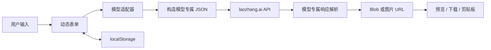

# AI PPT HTML

一个纯 HTML、CSS 和 JavaScript 实现的 AI PPT 单页图片生成工具。用户在浏览器中选择图像模型、设置模型参数、选择或编辑系统提示词，并输入一页 PPT 的文字内容；页面直接调用兼容的图像生成 API，将返回的图片展示、下载或复制到剪贴板。


## 项目目标

这个项目解决的不是 PPT 文件编辑问题，而是“把结构化页面文案生成一张可直接作为 PPT 单页使用的图片”。主要目标包括：

- 使用一个独立静态页面完成配置、生成、预览和结果复用。
- 不建设业务后端，浏览器直接调用自定义图像生成 API。
- 同时适配请求参数和响应结构完全不同的模型。
- 通过系统提示词约束画布比例、视觉风格、信息层级和文字准确性。
- 保留每个模型的本机参数，降低重复配置成本。
- 支持结果下载、复制到剪贴板和一键复用本次生成参数。

这里的 Serverless 指项目自身不包含服务端程序，并不代表请求不经过远程服务。图片仍由配置的 `laozhang.ai` API 生成。

## 当前能力

### 内容设置

- API 地址和 API Key 折叠显示。
- 模型参数根据当前模型的 schema 动态生成。
- 内置“企业战略白板信息图”和“现代极简商务”系统提示词。
- 支持编辑并保存自定义系统提示词。
- 页面文字内容使用可纵向拉伸的紧凑文本框。
- 点击生成后，浏览器标题更新为：`页面文字第一行《AI PPT 图片生成器》`。
- 标题栏和生成按钮旁均可在新标签页打开当前页面。

### 生成与结果处理

- 生成期间显示加载状态和动态秒表。
- 结果容器固定为 16:9，使用 `object-fit: contain` 完整显示任意比例图片。
- 显示生成时间、生成耗时、模型参数、系统提示词和页面文字快照。
- 支持下载生成图片，并根据实际 MIME 类型决定扩展名。
- 支持把图片复制到系统剪贴板；JPEG/WebP 会先转换为 PNG。
- 支持“复用参数”，将当前图片对应的完整参数回填到内容设置区。
- 兼容 API 返回 Base64 图片或远程图片 URL。

## 支持的模型

### GPT Image 2

- API URL：`https://api.laozhang.ai/v1/images/generations`
- 请求模型名：`gpt-image-2-vip`
- 请求格式：OpenAI Images 风格的扁平 JSON。
- 响应格式：`data[0].b64_json` 或 `data[0].url`。

| 参数 | 类型 | 默认值 | 可选范围 |
| --- | --- | --- | --- |
| `size` | select | `2048x1152` | 1K/2K/4K，覆盖 16:9、4:3、1:1、3:4、9:16 |
| `quality` | select | `high` | `high`、`medium`、`low` |
| `output_format` | select | `jpeg` | `png`、`jpeg`、`webp` |
| `output_compression` | integer/range | `50` | 0-100 |

4K 档的任意边不超过 3840，并且所有边长均为 16 的整数倍。

```json
{
  "model": "gpt-image-2-vip",
  "prompt": "系统提示词 + 页面文字内容",
  "size": "2048x1152",
  "quality": "high",
  "output_format": "jpeg",
  "output_compression": 50
}
```

### Nano Banana 2

- API URL：`https://api.laozhang.ai/v1beta/models/gemini-3.1-flash-image:generateContent`
- 请求格式：Gemini `generateContent` 风格的嵌套 JSON。
- 响应格式：`candidates[0].content.parts[].inlineData.data`。

| 参数 | 默认值 | 可选范围 |
| --- | --- | --- |
| `aspectRatio` | `16:9` | `16:9`、`4:3`、`1:1`、`3:4`、`9:16` |
| `output_format` | `jpeg` | `png`、`jpeg`、`webp` |
| `imageSize` | `2K` | `1K`、`2K`、`4K` |

当前适配器会把 `aspectRatio` 和 `imageSize` 写入 `generationConfig.imageConfig`。`output_format` 保留在界面和本机配置中，但当前代码未将其发送给 API，详见 `buildPayload()` 中的注释。

### Nano Banana Pro

- API URL：`https://api.laozhang.ai/v1beta/models/gemini-3-pro-image:generateContent`
- 参数、请求构造和响应解析完全继承 Nano Banana 2。
- 旧的 `gemini-3-pro-image-preview` 地址会在页面加载时自动迁移。

## 技术架构



### 文件结构

| 文件 | 作用 |
| --- | --- |
| `index.html` | 页面语义结构、表单容器、结果预览和操作按钮 |
| `styles.css` | 响应式布局、动态参数区、固定结果信息框和交互状态 |
| `app.js` | 模型 schema、API 调用、响应解析、持久化、下载、剪贴板和参数复用 |
| `sample-api-call.py` | 最初的 Python API 调用样例和系统提示词参考 |
| `sample.png` | README 界面示例图 |

### 模型适配层

模型差异集中在 `app.js` 的 `MODEL_CONFIGS` 中。每个模型配置包含：

- `label`：界面显示名称。
- `apiUrl`：模型默认 API 地址。
- `parameters`：动态表单 schema，包括字段名、控件类型、默认值、选项和数值类型。
- `buildPayload(prompt, values)`：把统一提示词和表单值转换为模型请求 JSON。
- `parseResponse(result)`：把模型响应转换为统一的 `{ kind, value, mimeType? }` 图片描述。
- `legacyApiUrls`：可选的旧地址列表，用于本机配置迁移。

主生成流程不关心具体模型参数。它只负责校验公共输入、调用当前适配器、发送 `fetch` 请求，并把解析后的图片交给统一预览流程。

新增独立模型的基本结构：

```js
MODEL_CONFIGS["new-model"] = {
  label: "New Model",
  apiUrl: "https://example.com/generate",
  parameters: [
    {
      name: "aspect_ratio",
      label: "图片比例",
      type: "select",
      default: "16:9",
      options: [{ value: "16:9", label: "16:9" }]
    }
  ],
  buildPayload(prompt, values) {
    return { input: prompt, options: values };
  },
  parseResponse(result) {
    return { kind: "base64", value: result.image };
  }
};
```

如果新模型与现有模型除 URL 外完全一致，可以使用对象展开继承适配器，Nano Banana Pro 即采用这种方式。

## 本机数据与参数快照

页面不使用 Cookie。配置通过 `localStorage` 保存在当前浏览器、当前站点下，键统一带有 `ai-ppt-html.` 前缀。

持久化内容包括：

- API Key。
- 每个模型各自的 API URL。
- 当前模型和各模型的动态参数。
- 当前系统提示词类型及自定义系统提示词。

模型参数使用模型 ID 作为命名空间，切换模型不会覆盖另一个模型的参数。若保存的 select 值已经从 schema 删除，页面会自动回退到该字段的默认值。

“复用参数”使用当前页面内存中的最近一次成功生成快照，包含 API 地址、API Key、模型、模型参数、系统提示词和页面文字。刷新页面后该快照不会恢复。

## 运行方式

项目没有构建步骤和第三方运行时依赖。推荐通过本地 HTTP 服务运行，而不是直接使用 `file://` 打开：

```powershell
cd D:\workspace\ai-ppt-html
python -m http.server 8080
```

访问 `http://localhost:8080/`，然后：

1. 点击齿轮，填写 API Key；必要时修改当前模型的 API URL。
2. 选择模型及其参数。
3. 选择系统提示词预设，或展开编辑自定义提示词。
4. 输入一页 PPT 的文字内容并点击“生成 PPT 图片”。
5. 生成成功后预览、复制、下载或复用参数。

## 浏览器与 API 要求

- API 必须允许浏览器跨域访问，并接受 `Authorization` 和 `Content-Type` 请求头。
- Clipboard API 通常要求安全上下文；`http://localhost` 或 HTTPS 页面可用性最好。
- 远程图片 URL 必须允许 CORS，浏览器才能重新读取图片并复制或下载；Base64 响应不受该限制。
- 建议使用近期版本的 Chrome、Edge 或其他 Chromium 浏览器。

## 安全说明

这是一个直接从浏览器调用 API 的个人工具，不适合在不可信的公共站点上直接部署长期有效的密钥。

- API Key 以明文形式保存在浏览器 `localStorage` 中。
- 同源页面脚本和拥有该浏览器配置访问权限的人可能读取 Key。
- Key 会通过 `Authorization: Bearer ...` 直接发送到当前界面显示的 API URL。
- 不要引入不可信第三方脚本，也不要在共享设备上保存生产密钥。
- 公网部署或多人使用时，应增加自有后端代理、短期令牌、权限控制和请求限额。

## 已知限制

- 生成结果和参数快照只保存在当前页面内存中，刷新后图片不会恢复。
- 没有请求取消、生成历史列表、并发队列和自动重试功能。
- 图片中的中文准确性、版式和视觉质量取决于所选模型及提示词。
- 图片 URL 模式下，下载和复制功能可能受到远程服务器 CORS 策略限制。
- 系统提示词与页面内容直接拼接，尚未提供模板变量或结构化内容编辑器。
